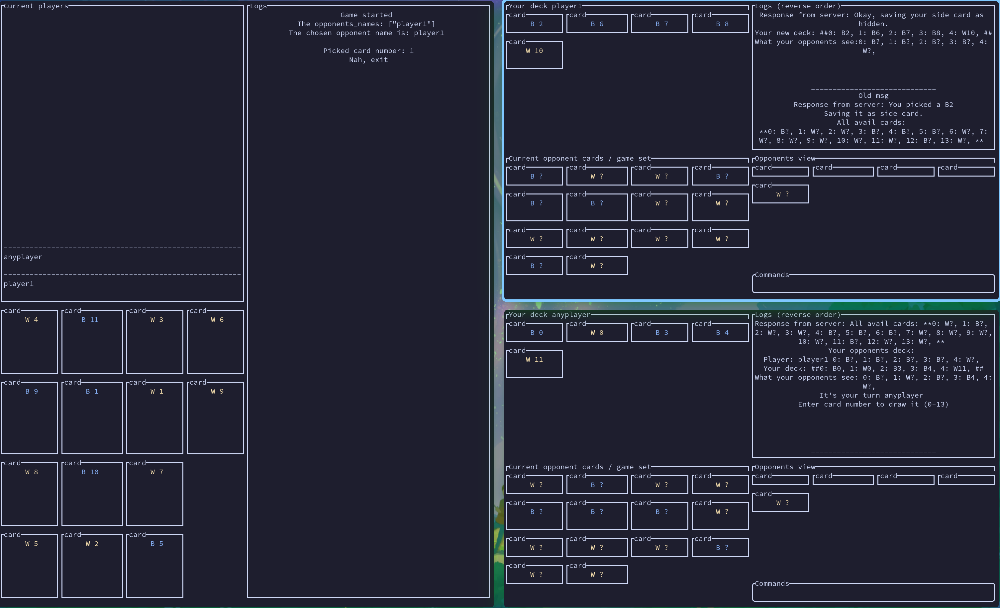

# Davinci Code

The Davinci Code board game written in Rust.

Play it with your friends over the internet.

[Learn more](https://www.ultraboardgames.com/davinci-code/game-rules.php)

### Run TUI

`cargo run --bin server -- --addr [IP_ADDR] --port [PORT]` for the server

`cargo run --bin client -- --name [UNAME] --addr [IP_ADDR] --port [PORT]` for
the clients

Server' view on the `left` window, and the two clients on the `right`.

#### Tips

`q` => `exit` for the server and the client

`i` => `Input mode` for the client

`Esc` => `Normal mode` for the client

### Run cli

`cargo run --bin server-cli -- --addr [IP_ADDR] --port [PORT]` for the server

`cargo run --bin client-cli -- --name [UNAME] --addr [IP_ADDR] --port [PORT]` for
the clients
